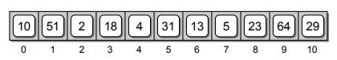

# Arrays


## Introduction
Arrays are one of the simplest and basic data structure that exists in all programing languages
 which is used for storing similar items in the memory. Arrays can be one-dimensional or multi-dimensional.
 The elements in Arrays are stored in contiguous bytes of memory and allows for random access to the individual elements.
 Each element of an Array is indexed starting from 0 as shown bellow.
 


Since Array is a data structure, we should be comfortable to know how perform these operations in the Arrays:
- Accessing elements
- Insert
- Delete 
- Update
- Search
The main operations with arrays are adding elements to them and reading elements from them. Every other operation is built on top of these two methods.
#### 1. Accessing an element in Array
to access and element in the array is quite simple. We just point to the index i of the array and the element will be returned to us.
For example, we have an array with [1, 'dog', 'cat', 5] and we want to to access
the element in index 0 and index 2, we use:

```python
>>> array=[1, 'dog', 'cat', 5]
>>> array[0]
1
>>> array[2]
'dog'
```
#### 2. Adding an element to Array 
There are many ways of inserting an element to an Array:
1. Inserting a new element at the end of the Array.
1. Inserting a new element at the beginning of the Array.
1. Inserting a new element at any given index inside the Array \n

Adding an element at the end of an array is easy. We can use the **append()** method to add new elements at the end of  Array.
We can also just add the new element to the array as a list.
```python
>>> array.append(6)
>>> array
[1, 'dog', 'cat', 5, 6]

>>> array=array+['sky']
>>> array
[1, 'dog', 'cat', 5, 6, 'sky']
```
Adding an element at the start or anywhere in the array is more complicated because all other indexes needs to change as well.
This is one of the flaws of Array data structure that adding and deleting and element is not efficient. The following code sniped shows
the method of adding a new element at a specified index to an array.
```python
array=[1, 'dog', 'cat', 5, 6, 'sky']
def insert(index, value):
    # First, we will have to create space for a new element.
    array.append(0)
    # then shift all the elements to the right from the index location
    for i in range(index,len(array)-1,-1):
        array[i+1]=array[i]
    # Finally assign the value of index
    array[index]=value
insert(0,'hi')
print(array)
```
Python has a built-in function that does this for us using **array.insert(index,value)** method.
```python
>>> array=[1, 'dog', 'cat', 5, 6, 'sky']
>>> array.insert(0,'hi')
>>> array
['hi', 1, 'dog', 'cat', 5, 6, 'sky']
```

#### 3. Deleting an element from Array 
Just like the insert method, deleting an element from an array requires changing the indexes of other elements unless it
is the last element of an array. Python has three built-in methods that can be used to delete an element 
from an array:
- **array.pop(index)**: This method removes the element with a specific index from an array and returns the removed element.
- **array.remove(value)**: This method removes the first matching element (which is passed as an argument) from the list. If there are multiple element of the
same value in an array, this method removes only the first one.
- **del array[index]**: This method deletes an element from an array without return anything.
```python
>>> array=[1, 'dog', 'cat', 5, 6, 'sky']
>>> array.pop(2)
'cat'
>>> array
[1, 'dog', 5, 6, 'sky']

>>> array.remove('sky')
>>> array
[1, 'dog', 5, 6]

>>> del array[0]
>>> array
['dog', 5, 6]
```
#### 4. Searching an element in Array 
Speed of searching is one of the most important  operation that makes the programmers decide what data structure to use for the problem to be solved with.
Searching means to find an occurrence of a particular element in the Array and return its position. We might need to search an Array to find out whether or not 
an element is present in the Array. We might also want to search an Array that is arranged in a specific fashion to determine which index to insert a new element at.
1. Linear search: In this method we look every element of an array one by one until we find that element and return its index. The following code snippet will perform linear search 
and return the index of the element that is equal to the value we are searching and prints "this element does not exist" when there is not such element in the array.
```python
def search(value):
    for index, val in enumerate(array):
        if val==value:
            return index
    return "this element does not exist"
```

* Binary Search
This method reduces time complexity of search to log(n) when the elements in the array are sorted. This algorithm will not work if the array is not sorted.
Binary search divides the array into half and checks if the middle element is bigger than the target value or smaller. If it was bigger, it will take the ride side of the mid point and repeats this process untill
the values is found.
```python
array=[1,3,5,7,9,10]
def binary_search(value):
    # initiate left and right pointers
    left, right=0, len(array)-1
    while left<=right:
        # find the mid-point index
        mid=(left+right)//2
        # check if the mid-point index is equal to the target value
        if value==array[mid]:
            return mid
        # If target value is bigger than the mid-point element, change the left index to mid+1
        elif value>array[mid]:
            left=mid+1
        # Otherwise, bring the right pointer to the mid-1
        else:
            right=mid-1
    # if the element does not exist, print the following
    return "this element does not exist"
```
## Examples problems with Arrays
#### 1. Max Consecutive Ones
Given a binary array nums, return the maximum number of consecutive 1's in the array.
Test case 1
```
Input: nums = [1,1,0,1,1,1]
Output: 3
Explanation: The first two digits or the last three digits are consecutive 1s. The maximum number of consecutive 1s is 3.
```
Test case 2
```
Input: nums = [1,0,1,1,0,1]
Output: 2
```
##### Solution [Code](code/max_consec_ones.py)
We can solve this problem by passing through every element in the array and keeping track of the
maximum number of consecutive ones. The following snipped shows the python solution.
```python
class Solution:
    def findMaxConsecutiveOnes(self, nums) -> int:
        # initiate a current max and maximum of the maximum values
        curmax, maximum=0, 0
        for i in range(len(nums)):
            # when the element is 1, increase the current max by one
            if nums[i]==1:
                curmax+=1
            # When the element is not 1, make the current max 0
            else:
                curmax=0
            # keep track of the maximum of them
            maximum=max(maximum,curmax)
        return maximum

result=Solution()
array=[1,1,0,1,1,1]
print(result.findMaxConsecutiveOnes(array))
```

#### 2. Find Numbers with Even Number of Digits
Given an array nums of integers, return how many of them contain an even number of digits..
Test case 1
```
Input: nums = [12,345,2,6,7896]
Output: 2
Explanation: 
12 contains 2 digits (even number of digits). 
345 contains 3 digits (odd number of digits). 
2 contains 1 digit (odd number of digits). 
6 contains 1 digit (odd number of digits). 
7896 contains 4 digits (even number of digits). 
Therefore only 12 and 7896 contain an even number of digits.
```
Test case 2
```
Input: nums = [555,901,482,1771]
Output: 1 
Explanation: 
Only 1771 contains an even number of digits.
```
##### Solution [Code](code/find_number_of_evens.py)
The problem is asking us to find the number of digits that have even number of digits. For example 23 has two digits
and 345 has three digits. We can solve this problem by converting each number in the array to a string and find the length
of that string and divide it by two. If there is nor reminder, we count that as an even number of digits.
```python
class Solution:
    def findNumbers(self, nums):
        # Start the counter from zero
        count=0
        # loop over each element in the bytearray
        for num in nums:
            # convert the number to a string and divid its length to 2.
            if len(str(num))%2==0:
                # if the remainder is equal to zero, increase the counter by one.
                count+=1
        return count
result=Solution()

# test 1
array=[12,345,2,6,7896]
print(result.findNumbers(array))

# test 2
array=[555,901,482,1771]
print(result.findNumbers(array))
```

#### 3. Duplicate Zeros
Given a fixed-length integer array arr, duplicate each occurrence of zero, shifting the remaining elements to the right.

Note that elements beyond the length of the original array are not written. Do the above modifications to the input array in place and do not return anything.
```
Input: arr = [1,0,2,3,0,4,5,0]
Output: [1,0,0,2,3,0,0,4]
Explanation: After calling your function, the input array is modified to: [1,0,0,2,3,0,0,4]
```
Test case 2
```
Input: arr = [1,2,3]
Output: [1,2,3]
Explanation: After calling your function, the input array is modified to: [1,2,3]
```
##### Solution [Code](code/duplicate_zeros.py)
The problem is asking us to find the number of digits that have even number of digits. For example 23 has two digits
and 345 has three digits. We can solve this problem by converting each number in the array to a string and find the length
of that string and divide it by two. If there is nor reminder, we count that as an even number of digits.
```python
class Solution:
    def duplicateZeros(self, nums):
        i = 0
        # loop over every element in the array
        while i<len(nums)-1:
            # if the element is zero, shift all the element to the right by one.
            if nums[i]==0:
                # shift all the element to the right by one
                for j in reversed(range(i,len(nums)-1)):
                    nums[j+1]=nums[j]
                # now that everything to the right is shifted, add a zero
                nums[i+1]=0
                # increase the step by one
                i+=1
            i+=1
        return nums


result=Solution()

# test 1
array=[1,0,2,3,0,4,5,0]
print(result.duplicateZeros(array))

# test 2
array=[1,2,3]
print(result.duplicateZeros(array))
```
#### 4. Merge Sorted Array
Problem statement
You are given two integer arrays nums1 and nums2, sorted in non-decreasing order, and two integers m and n, 
representing the number of elements in nums1 and nums2 respectively.

Merge nums1 and nums2 into a single array sorted in non-decreasing order.

The final sorted array should not be returned by the function, but instead be stored inside the array 
nums1. To accommodate this, nums1 has a length of m + n, where the first m elements denote the elements that 
should be merged, and the last n elements are set to 0 and should be ignored. nums2 has a length of n.

Test case 1
```
Input: nums1 = [1,2,3,0,0,0], m = 3, nums2 = [2,5,6], n = 3
Output: [1,2,2,3,5,6]
Explanation: The arrays we are merging are [1,2,3] and [2,5,6].
The result of the merge is [1,2,2,3,5,6] with the underlined elements coming from nums1.
```
Test case 2
```
Input: nums1 = [1], m = 1, nums2 = [], n = 0
Output: [1]
Explanation: The arrays we are merging are [1] and [].
The result of the merge is [1].
```
##### Solution [Code](code/merge_sorted_array.py)
The problem can be solved an easy way using sorted function in python. We take the slice of nums1 from 0 to m and 
combine it with nums2 and return the sorted result. I can be done in one line of code. Here we are using a built in
function of python. What if we are not allowed to use built-in functions? The second method is created to solve the 
problem using two pointer algorithm. It is a little hard, but if we track our pointers, we can solve it.

```python
class Solution:
    def merge_easy(self, nums1, m, nums2, n) -> None:
        return sorted(nums1[:m]+nums2)
    def merge(self,nums1, m, nums2, n):
        # copy the non zero elements from nums1
        copy = nums1[:m]
        # create two pointers one for nums1 and one for nums2
        l1 = 0
        l2 = 0
        # Compare elements from nums1Copy and nums2 and write the smallest to nums1.
        for p in range(n + m):
            # We also need to ensure that l1 and l2 aren't over the boundaries
            # of their respective arrays.
            if l2 >= n or (l1 < m and copy[l1] <= nums2[l2]):
                nums1[p] = copy[l1]
                l1 += 1
            else:
                nums1[p] = nums2[l2]
                l2 += 1
        return nums1
result=Solution()

# test #1
nums1, m = [1,2,3,0,0,0], 3
nums2, n = [2,5,6], 3
print(result.merge(nums1, m, nums2, n))

# test #2
nums1, m = [1], 1
nums2, n = [], 0
print(result.merge_easy(nums1, m, nums2, n))
```