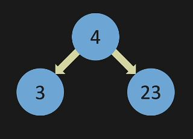
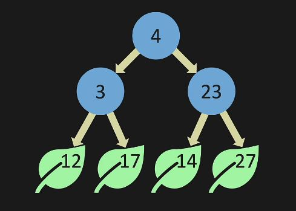

# Linked List

## Introduction
Binary trees are another powerful data structure that can be used to store a collection of data. It allows
for smaller memory allocation without requiring the element shifts for insertion and deletion operations. It has an efficient
 time complixity to search an item within the tree. 

Suppose we have a basic calss containing a single value its left and right point to None:

```python
class ListNode:
    def __init__(self, data):
        self.data = data
        self.left = None
        self.right = None
a = ListNode( 4 )
```
When we call the ListNode class with a data point 4, we get something like the following figure. A single node with two
arrows pointing to left and right nodes. Since this is the first node of our tree data structure, it is typically called 
the root of the tree, and from here, we create branches for the tree.


The left and right arrows are pointing at None, meaning that there is no other nodes in our data structure
because this is a single node and we can create two more nodes and assign them to left and right pointers.
```python
b = ListNode( 3 )
c = ListNode( 23 )
a.left = b
a.right = c
```
This is how the nodes will look like. The node 3 and 23 are added to the left and right branches. Nodes 3 and 23 both
have left and right branches pointing toards Non, since there is no other node that is connected to the data structure.



Lets create some more nodes and attach them to the node 3 and node 23.
```python
d = ListNode ( 12 )
e = ListNode ( 12 )
f = ListNode ( 12 )
g = ListNode ( 12 )
# We connect node b to d and e. 
# We also connect node c to f and g as left and right pointers
b.left = d
b.right = e
c.left = f
c.right = g
```
The tree data structure will look the following figure. The last nodes in the tree data structure is typically called 
the leaf node which is represeted using leaf shapes in the figure.

And this is how a tree data structure is built. For the rest of this document, we design a binary search tree data 
structure that supports insert, contain, minimum methods. We will also describe the concepts of tree traversals methods.

## Insert
The insert method will add a new data point to the tree structure depending on its value. The property
of the binary search tree is that left node should be smaller than main node and the main node should
be smaller than the right node. And this should be true in the entire tree data structure. If there is
a duplicate value, the method will return False. Otherwise, the method will go left and right untill it finds
right spot for the new number to be added.
```python
def insert(self, data):
    # create the new node
    new_node = ListNode(data)
    # check if root is empty
    if self.root is None:
        # if root is empty, make the root equal to new node
        self.root = new_node
        return
    # create a temp node equal to the root
    temp = self.root
    # Loop over the nodes. If data is smaller than the node, go left, otherwise go right.
    while temp:
        # If data is equal to the node return False
        if temp.data == data:
            return False
        # If data is smaller than the node, check if it is None.
        # If None, make it equal to new node, else go left.
        if data < temp.data:
            if temp.left is None:
                temp.left = new_node
                return
            temp = temp.left
        # If data is bigger than the node, check if it is None.
        # If None, make it equal to new node, else go right.
        else:
            if temp.right is None:
                temp.right = new_node
                return
            temp = temp.right
```


## contain
The contain method searches the binary search tree data structure and returns True if the element with
value data exists in our tree structure. If it doesn't exist, it will return False. It uses the property
of binary search tree and moves left and right in the tree until it reaches the leaf node. If it sees
the data in the tree, it returns True, otherwise, it returns False.

```python
def contain(self, data):
    # create a temp node equal to the root
    temp = self.root
    # loop over the nodes
    while temp:
        # if data is equal to the node, return true
        if temp.data == data:
            return True
        # if data is smaller than the node, go left. Otherwise go right.
        if data < temp.data:
            temp = temp.left
        else:
            temp = temp.right
    # return False if no node is equal to the data
    return False
```
## minimum value
Minimum value method takes a node in the binary search tree and return the smallest element within 
that sub-tree. If we start from the root node, it returns the smallest element within the entire
tree. It is a simple method which goes to the left nodes until the leaf nodes is reached. Then the 
leaf node at the farthest left is returned.

```python
@staticmethod
def min_value_node(cur_node):
    # minimum node is the node the bottom left of the tree.
    # So go left until it is None.
    while cur_node.left is not None:
        cur_node = cur_node.left
    return cur_node
```

# Tree traversals
#### 1. Breath first search (BFS)

```python
def BFS(self):
    # initiate a list for result and one for the queue
    results = []
    queue = []
    # check if root is empty
    if self.root is None:
        return results
    # append the root to the queue
    queue.append(self.root)
    # loop until there is a node in the queue
    while queue:
        # remove the first element
        new_node = queue.pop(0)
        # add its value to the results
        results.append(new_node.data)
        # if left node is not none, add that to the queue
        if new_node.left is not None:
            queue.append(new_node.left)
        # if the right node is not None, add that to the queue as well
        if new_node.right is not None:
            queue.append(new_node.right)
    # return the results list
    return results
```
#### 2. Depth first search (DFS) pre-order


```python
 ```
#### 3. Depth first search (DFS) post-order

```python

```
#### 4. Depth first search (DFS) in-order
```python

    
```

## Examples problems with binary tree


#### 1. Example 1


##### Solution [Code](code/linked_list.py)

#### 2.Example 2

##### Solution [Code](code/linked_list.py)

```python

```

#### 3. Example 3

##### Solution [Code](code/ll_cycle.py)

```python

```

#### 4. Example 4

##### Solution [Code](code/merge_sorted_array.py)
```python

```

#### 5. Example 5

##### Solution [Code](code/valid_mountain.py)
```python

```
## Next Steps

This file will continuously be updated.

