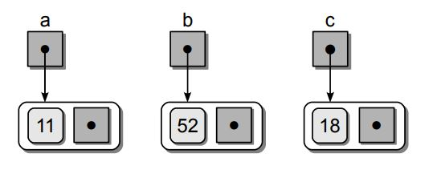
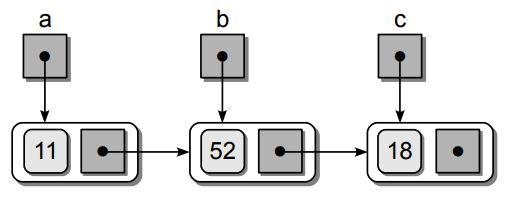
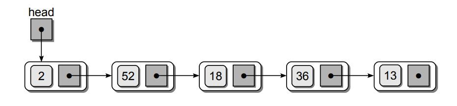
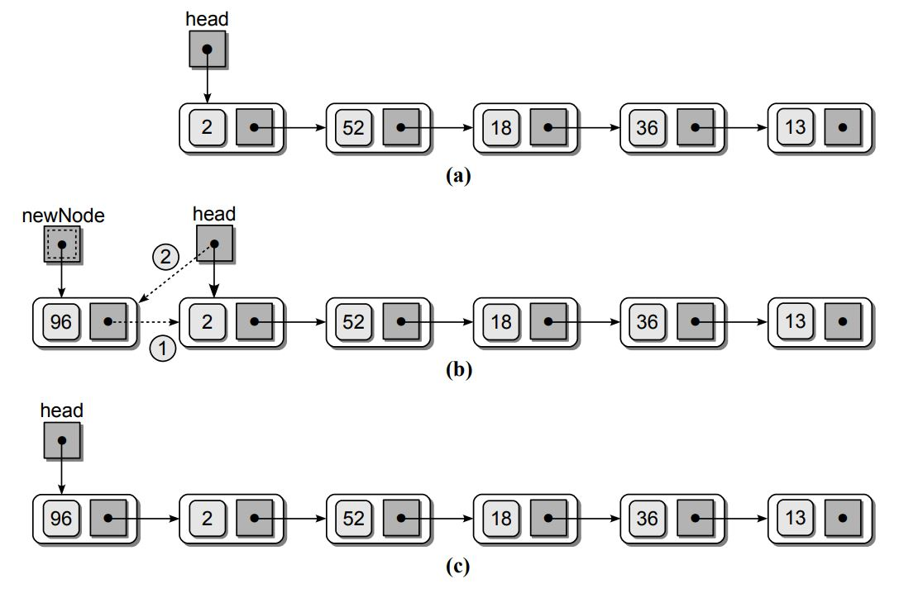

# Linked List

## Introduction
Linked list is another powerful data structure that can be used to store a collection in a linear order. It allows
for smaller memory allocation without requiring the element shifts for insertion and deletion operations. It still requires
linear time complixity to search an item just like arrays. There are multiple types of linked-lists:
* Singly linked-list
* Doubly linked-list
* circular singly and doubly linked-list

we will first explain the concept of linked-list using a singly linked-list structure which is the easiest to understand.
Suppose we have a basic calss containing a single value a next point to None:

```python
class ListNode :
    def __init__( self, data ) :
        self.data = data
        sef.next = None
```

This is a single node and we can create several instances of this node and each containing an integer value.
```python
a = ListNode( 11 )
b = ListNode( 52 )
c = ListNode( 18 )
```
This is how the nodes will look like. 



Finally, we can point each node to each other where a points to b and b points to c.
```python
a.next = b
b.next = c
```

once all nodes are connected, we do not need to have b and c references. All we need is the value at the begining of the list
which in this case is a. We can find the values in the other nodes as:

```python
print( a.data )
print( a.next.data )
print( a.next.next.data )
```

The first node in the linked-list, must be named
or referenced by an external variable as it provides an entry point into the linked
list. This variable is commonly known as the head pointer, or head reference. A
linked list can also be empty, which is indicated when the head reference is null.


Since Array is a data structure, we should be comfortable to know how perform these operations in the linkedList:
- Printing the list
- Insert
- Search
- get
- Delete 
- Update


#### 1. Printing the list
The process starts by assigning a temporary external reference **temp**  to
point to the head of the linked-list. Then we start a while loop and 
the value stored in the first node is printed by accessing the data component
stored in the node using the external reference. The external reference is then
advanced to the next node by assigning it the value of the **temp**  link field.
 The loop iteration continues until every node in the list has been accessed or **temp** is None.

```python
def print_list(self):
    # start from the head of linked-list
    temp=self.head
    # loop over each element until the temp.next is None
    while temp is not None:
        # at each node, print the data
        print(temp.data)
        # got to the next node
        temp=temp.next
```
#### 2. - Insert
Inserting an element to an array takes many forms:
- inserting at an arbitrary location in the linked-list.
- appending the linked-list.
- prepending the linked-list.

We create three methods for each of the insert operations listed above. Inserting an element at an index
is a O(n) operation at the most. We do not have to shift the elements to the right as we had to for the array
insert operation. 

```python
def insert_by_index(self, index, data):
    # initiate the new node using the new data
    new_node = ListNode(data)
    # check if index is below zero
    if index<0:
        return False
    # check if the new node is a prepend
    if index==0:
        new_node.next=self.head
        self.head=new_node
        return
    # get the node before using the get() method
    temp=self.get(index-1)
    # check to see if it is a tail node
    if temp.next==self.tail:
        self.tail.next=new_node
        self.tail=new_node
    else:
        # call the node where the current index exist as **after**
        after=temp.next
        # connect the temp node to new node
        temp.next=new_node
        # connect the new_node to after node
        new_node.next=after
 ```

Appending and pre-pending a linked-list is simple as far as we track the **head** and **tail** nodes. 

```python
def insert_tail(self,data):
    # initiate the new node using the new data
    new_node = ListNode(data)
    # if there is not head, create the head node
    if self.head is None:
        self.head=new_node
        self.tail=new_node
    # if it is not the head node, point the tail to the new node and change tail
    else:
        self.tail.next=new_node
        self.tail=new_node
def insert_head(self,data):
    # initiate the new node using the new data
    new_node = ListNode(data)
    # if there is not head, create the head node
    if self.head is None:
        self.head=new_node
        self.tail=new_node
    # if it is not the head node, point the tail to the new node and change tail
    else:
        new_node.next=self.head
        self.head=new_node
```


#### 3. Search
A linear search operation can be performed on a linked-list just the same way as the arrays.
 It is very similar to the way we printed the values of linked-list earlier. 
 The only difference is that the loop can terminate
early if we find the target value within the list.



```python
def search(self, data):
    # start from the head of linked-list
    temp=self.head
    # loop until the end of linked-list
    while temp is not None:
        # if the node values is equal to data, return True
        if temp.data==data:
            return True
        # go to the next node
        temp=temp.next
    # if the values is not there, return False
    return False
```
#### 4. get
```python
def get(self, index):
    # check if head is None or index is below zero
    if self.head is None and index<0:
        return False
    # start from the head of linked-list
    temp=self.head
    # loop over each element until the index
    for _ in range(index):
        # check if the index is more than the length of linked_list
        if temp is None:
            return False
        temp=temp.next
    # return the node value
    return temp
    
```
#### 5. Delete


```python
def delete(self, index):
    # check if head is None or index is below zero
    if self.head is None and index<0:
        return False
    # check if it is the head node
    if index==0:
        self.head=self.head.next
    # get the node before using the get() method
    temp=self.get(index-1)
    # check to see if it is a tail node
    if temp.next==self.tail:
        temp.next=None
        self.tail=temp
    else:
        temp.next=temp.next.next
        
```
#### 6. Update

```python
def update(self, index, data):
    # get the element using its index and get() method
    temp=self.get(index)
    # change its data
    temp.data=data
    
```
## Examples problems with linked-list


#### 1. Design a linked-list data structure

##### Solution [Code](code/linked_list.py)


#### 2. 

##### Solution [Code](code/find_number_of_evens.py)

#### 3.

##### Solution [Code](code/duplicate_zeros.py)

#### 4.

##### Solution [Code](code/merge_sorted_array.py)


#### 5. 

##### Solution [Code](code/valid_mountain.py)

## Next Steps

This file will continuously be updated.

